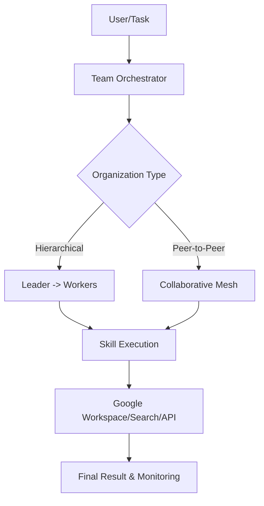

#  AI – Collective
<p align="center">

</p>

<p align="center">
<strong>A high-performance multi-agent orchestration platform for programmable AI workforces.</strong>
</p>

<p align="center">
<a href="#-key-features">Features</a> •
<a href="#-architecture">Architecture</a> •
<a href="#-quick-start">Quick Start</a> •
<a href="#-use-cases">Use Cases</a>
</p>

-----

## 🤖 What is AI – Collective?

**AI – Collective** is an open-source framework designed to model, orchestrate, and execute complex workflows through **Customizable Multi-Agent Teams**. Unlike standard chatbots, it enables the creation of an "AI Workforce" where agents possess specific skills, follow organizational hierarchies (Peer-to-Peer, Hierarchical, or Self-Organizing), and collaborate to solve high-level objectives.

## ✨ Key Features

| Feature | Description |
| :--- | :--- |
| **Atomic Skill System** | Define granular capabilities (Market Analysis, Web Search, API Integration) and inject them into agents. |
| **Agent Personas** | Create agents with unique identities, roles, and behavioral constraints. |
| **Dynamic Team Structures** | Model real-world organizations: Flat teams for brainstorming or Hierarchical for production. |
| **Multi-Agent Discussion** | Real-time message exchange, critique, and consensus-building between agents. |
| **Human-in-the-Loop** | Seamlessly intervene in agent discussions to provide feedback or steer the workflow. |
| **Real-time Monitoring** | Comprehensive dashboard to track task progress, agent logs, and system performance. |

## 🏗️ Architecture

AI – Collective is built with a focus on **Clean Architecture** and **Asynchronous Execution**.



  * **Frontend**: React + TypeScript + Vite + Tailwind CSS + Framer Motion.
  * **Backend**: FastAPI (Python 3.11+) with Clean Architecture boundaries.
  * **Intelligence**: LLM-agnostic (optimized for Gemini-2.0-Flash) via agent-graph orchestration.
  * **Storage**: Lightweight JSON-based persistence for rapid development.

## 🚀 Quick Start

### 1\. Installation

```bash
# Clone the repository
git clone https://github.com/SuZeAI/ai-collective.git
cd ai-collective

# Install Frontend dependencies
npm install

# Setup Backend with 'uv'
uv sync
```

### 2\. Configuration

Create a `.env` file in the root directory:

```env
# Backend LLM provider selection
LLM_PROVIDER=google
LLM_MODEL=gemini-3-flash-preview

# Optional provider keys
GOOGLE_API_KEY=<YOUR_GOOGLE_API_KEY_HERE>
ANTHROPIC_API_KEY=<YOUR_ANTHROPIC_API_KEY_HERE>
OPENAI_API_KEY=<YOUR_OPENAI_API_KEY_HERE>
OPENROUTER_API_KEY=<YOUR_OPENROUTER_API_KEY_HERE>

LOG_CONSOLE=true
LOG_FILE=true
LOG_LEVEL=DEBUG

GOOGLE_OAUTH_CLIENT_SECRET_PATH=<PATH_TO_YOUR_GOOGLE_OAUTH_CLIENT_SECRET_JSON_FILE_HERE>
```

### 3\. Execution

```bash
# Start Frontend
npm run dev

# Start Backend (Separate terminal)
uvicorn backend.api.main:app --reload --port 8000
```

## 🛠️ System Components

  * **Skill System**: The DNA of agents. Supports both cognitive (logic) and tool-based (API) skills.
  * **Communication Layer**: Manages message passing, state synchronization, and streaming (SSE).
  * **Monitoring**: A transparent log system to "watch your team work" in real-time.

## 🧪 Use Cases

  * **Financial Analysis**: Team of analysts debating market trends based on real-time news.
  * **Content Pipeline**: Strategy -\> Drafting -\> Critiquing -\> Final Polish.
  * **Software Research**: Automated vulnerability detection and documentation generation.

## 🤝 Contributing

We welcome contributions\! Please follow the Clean Architecture patterns established in the backend and ensure all frontend components are modular.

## 👨‍💻 Author

**SuZeAI (SuzeNith)** - AI Research Engineer focused on autonomous multi-agent systems.

-----

<p align="center">
Released under the <a href="LICENSE">MIT License</a>.
</p>
